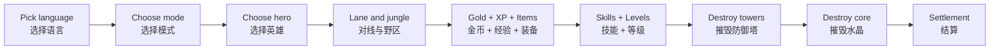

# Aether Clash

**A playable 2D MOBA arena you can run, study, and extend.**

**一款可以直接运行、阅读源码并继续扩展的 2D MOBA 竞技场游戏。**


| English | 简体中文 |
| --- | --- |
| A compact MOBA sandbox built with only Python standard library and `tkinter`: heroes, skills, AI, lanes, towers, jungle, shop, XP, scoreboard, and bilingual UI in one readable codebase. | 一个只用 Python 标准库和 `tkinter` 做出来的紧凑 MOBA 沙盒：英雄、技能、AI、兵线、防御塔、野区、商店、经验、战绩面板和中英双语 UI 都在一个可读代码库里。 |

`Python` `tkinter` `MOBA` `Game Sandbox` `Learning Project` `Bilingual UI` `No third-party dependencies`

**Language / 语言:** [简体中文](#zh) | [English](#en)

| Why it is worth a look | 为什么值得看 |
| --- | --- |
| It is not just a toy scene: it has lanes, objectives, AI choices, skills, equipment, XP, levels, UI flow, and settlement. | 它不是单个小游戏场景，而是有兵线、目标点、AI 决策、技能、装备、经验、等级、页面流程和结算的完整原型。 |
| It is intentionally readable: rendering, input, combat, AI, economy, map systems, and player actions are split into focused modules. | 它刻意保持可读：渲染、输入、战斗、AI、经济、地图系统和玩家动作已经拆成清晰模块。 |
| It runs without installing packages, which makes it easy to clone, run, inspect, and modify. | 它不需要安装依赖，适合直接 clone、运行、读源码和继续改。 |

### At a Glance / 一眼看懂

| Heroes | Modes | Equipment | Languages | Dependencies | Entry |
| --- | --- | --- | --- | --- | --- |
| 5 | 3 | 12 | 中文 / English | 0 third-party packages | `python main.py` |



> This is an original learning/prototype project. It does not use Honor of Kings assets, names, branding, or proprietary data.
>
> 这是一个原创学习/原型项目，不使用《王者荣耀》的素材、名称、品牌或专有数据。

## <a id="zh"></a>简体中文

### 项目简介

`Aether Clash` 是一个可直接运行的 2D MOBA 原型沙盒。当前重点是先完善 1v1 体验，再逐步扩展到 3v3 / 5v5，并在后续阶段迁移到 `pygame`。

当前版本不需要安装第三方依赖，只使用 Python 标准库。

### 适合谁

- 想看一个 MOBA 游戏核心循环如何拆成代码的人。
- 想学习游戏 AI、兵线推进、防御塔仇恨、技能冷却、装备成长和结算流程的人。
- 想从一个小而完整的 Python 游戏原型继续扩展的人。
- 想给 coding agent 一个可读、可改、可验证的游戏项目样本的人。

### 项目亮点

| 亮点 | 价值 |
| --- | --- |
| 纯 Python 标准库 | clone 后直接运行，环境成本低。 |
| 模块化结构 | 后续加英雄、改 AI、换渲染层更容易。 |
| 中英双语 UI | 适合中文玩家，也方便英文 README 展示。 |
| 真实 MOBA 子系统 | 不是只画角色移动，而是有经济、经验、技能、目标点和结算。 |
| 可迁移路线 | 先把玩法跑通，再迁移到 `pygame` 做更强表现。 |

### 快速开始

```powershell
git clone https://github.com/zhangzhanglaila/aether-clash.git
cd aether-clash
python main.py
```

### 局域网 1v1

房主是蓝方，负责权威计算整局游戏；加入者是红方，只发送输入并接收房主快照。

房主电脑运行：

```powershell
python main.py --lan-host --hero vanguard --remote-hero ranger --mode rank
```

另一台电脑加入：

```powershell
python main.py --lan-join 192.168.1.20 --hero ranger --remote-hero vanguard --mode rank
```

- 把 `192.168.1.20` 换成房主电脑的局域网 IP。
- 默认端口是 `8765`，可用 `--port 9000` 修改。
- 两边的 `--hero` 和 `--remote-hero` 要互相对应。
- 如果 Windows 防火墙弹窗，允许 Python 访问局域网。

### 当前玩法

- 启动后先选择 `中文` 或 `English`。
- 进入大厅后选择对战模式，再进入英雄选择。
- 选择英雄后进入加载页，然后开始对局。
- 当前是蓝方玩家英雄对战红方 AI 英雄。
- 地图包含三路兵线、防御塔、双方主水晶、野区营地、远古守卫、河道和草丛。
- 摧毁敌方基地水晶获胜。

### 操作方式

| 操作 | 说明 |
| --- | --- |
| `W A S D` / 方向键 | 移动 |
| 鼠标移动 | 瞄准 |
| 鼠标左键 / `Space` | 普攻 |
| 点击敌方单位 / 野怪 | 锁定目标 |
| `T` | 切换附近可锁定目标 |
| 按住 `Q / E / R` | 显示技能范围指示器 |
| 松开 `Q / E / R` | 释放技能 |
| 技能瞄准时左键 | 释放当前瞄准技能 |
| 技能瞄准时右键 | 取消技能 |
| `Z / X / C` | 升级 `Q / E / R` |
| `B` | 回城 |
| `F` | 闪现 |
| `G` | 治疗 |
| `1-9` | 在基地附近购买装备 |
| `Tab` | 查看战绩面板 |
| `Esc` | 退出 |

### 英雄

| 英雄 | 定位 | 特点 |
| --- | --- | --- |
| 铁卫 / Vanguard | 战士 | 高血量，长矛穿透、冲锋和区域爆发。 |
| 星弓 / Star Ranger | 射手 | 高攻速和高射程，三连射、位移和扇形箭雨。 |
| 雷法 / Storm Arcanist | 法师 | 身板较脆但爆发高，穿透法球、护盾治疗和大范围雷暴。 |
| 玄甲 / Iron Sentinel | 坦克 | 承伤能力强，近身震荡、防御强化和大范围控制。 |
| 影刃 / Night Shade | 刺客 | 移速和爆发高，短距影切、突进斩击和处决爆发。 |

### 模式区别

| 模式 | 区别 |
| --- | --- |
| 水晶峡谷 | 标准节奏，建筑和 AI 强度均衡。 |
| 训练营 | AI 更弱，开局等级和金币更高，兵线更慢，适合试英雄。 |
| 快速对决 | 兵线刷新更快，经验和金币更多，建筑更脆，节奏更快。 |

### 已实现内容

- 三路兵线，包含近战兵、远程兵和周期性攻城兵。
- 摧毁敌方高地塔后，对应路线会刷新强化兵。
- 防御塔和双方主水晶都会自动攻击靠近的敌方单位。
- 野怪会攻击靠近英雄，死亡后按营地时间复活。
- 河道贯穿地图中心，草丛会影响远距离视野和锁定。
- 英雄升级会提升生命、攻击、射程和技能战斗力。
- 技能等级会提升伤害/治疗并缩短冷却。
- 敌方英雄会按模式获得经验并升级，等级显示在头顶。
- 敌方 AI 会根据血量和局势选择进攻、补兵、打野、守塔或回城。
- 商店包含 12 件装备，覆盖攻击、法术、防御、移动和打野类别。
- 部分装备有前置件和被动效果。
- HUD 包含小地图、计时器、比分、经验条、技能按钮和底部功能键。
- 战绩面板显示双方等级、击杀/死亡、金币、装备等级和技能等级。
- 结算页显示胜负、时长、等级、击杀/死亡、金币、推塔和技能等级。
- 普攻、技能命中、升级、摧毁建筑、击杀、连杀和终结都有视觉反馈。

### 代码结构

| 文件 | 职责 |
| --- | --- |
| [`main.py`](main.py) | 程序入口、窗口创建、对局初始化、主循环和跨系统调度。 |
| [`game_data.py`](game_data.py) | 数据类、常量、英雄、模式、地图数据和本地化文本。 |
| [`equipment_data.py`](equipment_data.py) | 装备配置和英雄推荐出装。 |
| [`rendering.py`](rendering.py) | 画布绘制、HUD、菜单、小地图、商店、战绩和结算页。 |
| [`input_handler.py`](input_handler.py) | 键盘、鼠标、语言选择、模式选择、英雄选择和点击路由。 |
| [`combat.py`](combat.py) | 普攻、技能、伤害、控制、锁定、经验、等级和战斗反馈。 |
| [`ai.py`](ai.py) | 敌方英雄 AI 决策、移动、守塔、补兵、打野和撤退。 |
| [`map_systems.py`](map_systems.py) | 兵线、野怪、防御塔、水晶、死亡清理、复活和草丛视野。 |
| [`economy.py`](economy.py) | 商店范围、购买装备、装备依赖和推荐购买。 |
| [`player_actions.py`](player_actions.py) | 回城、敌方回城、闪现、治疗和召唤师技能冷却。 |
| [`docs/code-structure.md`](docs/code-structure.md) | 模块边界说明。 |
| [`docs/hok-inspired-roadmap.md`](docs/hok-inspired-roadmap.md) | 后续玩法完善计划。 |

### 开发路线

1. 先完善 1v1：对线、英雄、AI、装备、升级、反馈和结算。
2. 再扩展 3v3 / 5v5：多英雄、多 AI、队伍目标和更完整地图。
3. 后续迁移到 `pygame`：更好的渲染、音效、资源加载和帧率控制。
4. 保留中英双语。

## <a id="en"></a>English

### Overview

`Aether Clash` is a runnable 2D MOBA prototype sandbox. The current focus is to polish the 1v1 experience first, then expand toward 3v3 / 5v5, and later migrate the renderer/runtime to `pygame`.

The current version uses only the Python standard library. No third-party dependencies are required.

### Who Is This For?

- Developers who want to study how a MOBA core loop can be represented in code.
- Learners interested in game AI, lane pressure, tower targeting, cooldowns, item growth, and match settlement.
- Builders who want a small but complete Python game prototype to extend.
- Coding agent users who want a readable, modular, verifiable game project.

### Highlights

| Highlight | Value |
| --- | --- |
| Pure Python standard library | Clone and run without dependency setup. |
| Modular architecture | Easier to add heroes, tune AI, rebalance combat, or swap the renderer later. |
| Bilingual UI | Usable in Simplified Chinese and English. |
| Real MOBA subsystems | Includes economy, XP, skills, objectives, AI decisions, and settlement. |
| Migration-ready roadmap | Gameplay first, then a future `pygame` runtime for better presentation. |

### Quick Start

```powershell
git clone https://github.com/zhangzhanglaila/aether-clash.git
cd aether-clash
python main.py
```

### LAN 1v1

The host plays blue side and runs the authoritative simulation. The joining player controls red side, sends input, and receives state snapshots from the host.

On the host PC:

```powershell
python main.py --lan-host --hero vanguard --remote-hero ranger --mode rank
```

On the joining PC:

```powershell
python main.py --lan-join 192.168.1.20 --hero ranger --remote-hero vanguard --mode rank
```

- Replace `192.168.1.20` with the host PC's LAN IP.
- The default port is `8765`; use `--port 9000` to change it.
- `--hero` and `--remote-hero` should match on both sides.
- If Windows Firewall prompts, allow Python on the local network.

### Gameplay

- Choose `中文` or `English` after launch.
- Pick a match mode in the lobby, then choose a hero.
- After hero selection, the game enters a loading screen and starts the match.
- The current match is blue player hero versus red AI hero.
- The map includes three lanes, towers, team cores, jungle camps, an Ancient Guard, river, and brush.
- Destroy the enemy core to win.

### Controls

| Input | Action |
| --- | --- |
| `W A S D` / Arrow keys | Move |
| Mouse move | Aim |
| Left click / `Space` | Basic attack |
| Click enemy unit / jungle monster | Lock target |
| `T` | Cycle nearby lockable targets |
| Hold `Q / E / R` | Show skill indicator |
| Release `Q / E / R` | Cast skill |
| Left click while aiming | Cast aimed skill |
| Right click while aiming | Cancel skill |
| `Z / X / C` | Upgrade `Q / E / R` |
| `B` | Recall |
| `F` | Flash |
| `G` | Heal |
| `1-9` | Buy equipment near base |
| `Tab` | Show scoreboard |
| `Esc` | Quit |

### Heroes

| Hero | Role | Traits |
| --- | --- | --- |
| Vanguard / 铁卫 | Fighter | Durable frontliner with piercing spear, dash, and area burst. |
| Star Ranger / 星弓 | Marksman | High attack speed and range with triple shot, dash reset, and arrow storm. |
| Storm Arcanist / 雷法 | Mage | Fragile burst caster with piercing orb, shield heal, and large thunder field. |
| Iron Sentinel / 玄甲 | Tank | High durability with close-range shock, fortify, and wide-area control. |
| Night Shade / 影刃 | Assassin | Fast burst hero with shadow slash, engage dash, and execute burst. |

### Match Modes

| Mode | Difference |
| --- | --- |
| Crystal Rift | Standard pacing with balanced structures and AI strength. |
| Training Camp | Weaker AI, higher starting level and gold, slower waves. Good for testing heroes. |
| Quick Duel | Faster waves, more XP and gold, weaker structures, faster match tempo. |

### Implemented Features

- Three lanes with melee, ranged, and periodic siege minions.
- Destroying an enemy base tower empowers the corresponding lane.
- Towers and both cores automatically attack nearby enemy units.
- Jungle monsters attack nearby heroes and respawn by camp timer.
- River and brush affect visibility and target locking.
- Level-ups increase health, attack, range, and skill combat power.
- Skill levels increase skill value and reduce cooldowns.
- Enemy hero gains XP by mode, levels up, and shows level above the hero.
- Enemy AI can fight, last-hit, jungle, defend, retreat, or recall.
- Shop includes 12 equipment items across attack, magic, defense, movement, and jungle categories.
- Some equipment items have requirements and passive effects.
- HUD includes minimap, timer, score, XP bar, skill buttons, and bottom utility row.
- Scoreboard shows level, kills/deaths, gold, equipment levels, and skill levels.
- Settlement screen shows result, duration, level, kills/deaths, gold, towers destroyed, and skill levels.
- Attacks, skill hits, level-ups, destroyed structures, kills, streaks, and shutdowns have visual feedback.

### Code Structure

| File | Responsibility |
| --- | --- |
| [`main.py`](main.py) | App entry, window setup, match initialization, main loop, and subsystem orchestration. |
| [`game_data.py`](game_data.py) | Dataclasses, constants, heroes, modes, map data, and localization text. |
| [`equipment_data.py`](equipment_data.py) | Equipment definitions and recommended builds. |
| [`rendering.py`](rendering.py) | Canvas drawing, HUD, menus, minimap, shop, scoreboard, and settlement. |
| [`input_handler.py`](input_handler.py) | Keyboard, mouse, language selection, mode selection, hero selection, and click routing. |
| [`combat.py`](combat.py) | Attacks, skills, damage, control, target lock, XP, levels, and combat feedback. |
| [`ai.py`](ai.py) | Enemy AI decisions, movement, defense, last-hitting, jungling, and retreat behavior. |
| [`map_systems.py`](map_systems.py) | Waves, monsters, towers, cores, cleanup, respawn, and brush visibility. |
| [`economy.py`](economy.py) | Shop range, item purchasing, item requirements, and recommended buying. |
| [`player_actions.py`](player_actions.py) | Recall, enemy recall, flash, heal, and summoner cooldowns. |
| [`docs/code-structure.md`](docs/code-structure.md) | Module boundary notes. |
| [`docs/hok-inspired-roadmap.md`](docs/hok-inspired-roadmap.md) | Future gameplay roadmap. |

### Roadmap

1. Polish 1v1 first: laning, heroes, AI, equipment, leveling, feedback, and settlement.
2. Expand to 3v3 / 5v5: multiple heroes, team AI, team objectives, and fuller map behavior.
3. Migrate to `pygame`: better rendering, audio, asset loading, and frame control.
4. Keep Simplified Chinese and English UI.

## Repository Metadata

| Field | Value |
| --- | --- |
| Repository | `zhangzhanglaila/aether-clash` |
| Language | Python |
| UI runtime | `tkinter` |
| Dependencies | Python standard library only |
| Entry point | [`main.py`](main.py) |
| Run command | `python main.py` |
| Current focus | Playable 1v1 MOBA sandbox |
| License | Not specified yet |

### Topics

`python` `tkinter` `game` `moba` `prototype` `bilingual` `ai` `2d-game`

### Stats

| Metric | Value |
| --- | --- |
| Hero count | 5 |
| Match modes | 3 |
| Equipment items | 12 |
| Supported languages | 简体中文, English |
| Third-party packages | 0 |
